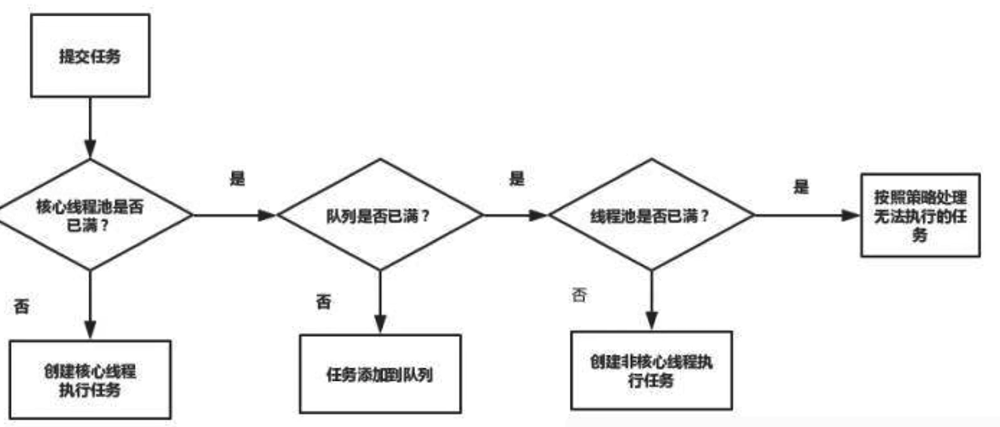
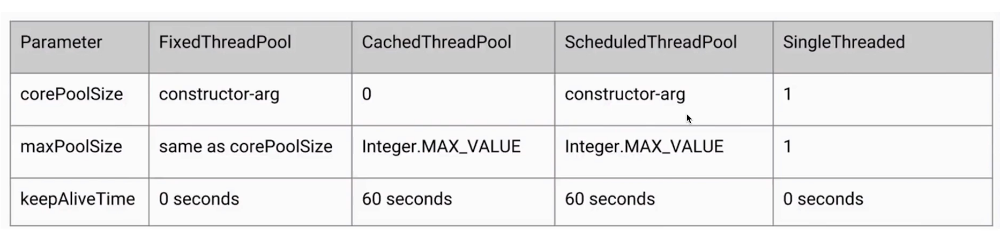
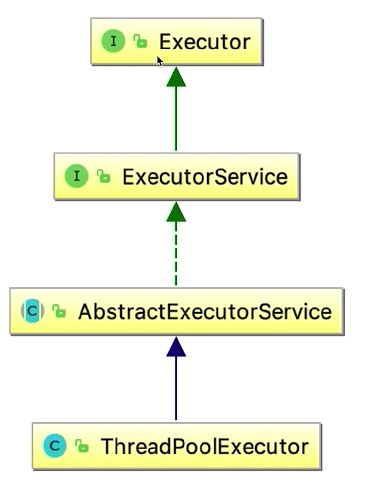

# Java Util Concurrent

## Category
- thread safety
    + mutex: lock, synchronized, Collections.synchronizedList, Vector
    + no mutex: Atomic Object, Adder
    + concurrent collection: CurrentHashMap, CopyOnWriteArrayList
    + non synchronized: final, ThreadLocal
- thread management
    + Thread Pool: Executor, ThreadPool
    + Return result: Callable, Future, FutureTask
- thread coordination
    + CountDownLatch, Semaphore
    + AQS
***    
    
## Thread Pool
#### Overview
- reuse the thread
- mange number of thread in pool
- thread per task
    + overhead of creation of thread
    + unlimited tasks to create too much thread
 - thread pool
    + no overhead of creation and destroy thread
    + manage CPU and memory
    + central management of pool
- scenario
    + server
    + more than 5 threads
- only scale up when work queue is full
- if workQueue does not has limit, then will not reach maximum thread size  
#### Parameters
- corePoolSize
    + after thread pool initialization, there is no thread
    + wait for coming tasks to create thread to reach core pool size
- maxPoolSize
    + max thread in pool
    + create additional threads after workQueue is full
- keepAliveTime: thread idle over keepAliveTime when thread size is greater than core pool size
- workQueue
    + store task
    + SynchronousQueue: no capacity: caused OOM is workQueue is too large, e.g. FixedThreadPool, SingleThreadPool
    + LinkedBlockingQueue: unbounded queue
    + ArrayBlockingQueue: bounded queue
    + recommended create thread pool manually
- threadFactory: default is Executors.defaultThreadFactory(), define the thread name, prority, daemon
- RejectedExecutionHandler

#### Types
- FixedThreadPool: LinkedBlockingQueue does not have limit bound, may cause OOM, 0s keepAlive Time
- SingleThreadPool: LinkedBlockingQueue does not have limit bound, may cause OOM, 0s keepAlive Time
- CachedThreadPool: SynchronizedQueue only contains 1 task, idle thread destroy unlimited thread may cause OOM, 60s keepAlive Time
- ScheduleThreadPool: schedule one time or periodic task, 60s keepAlive Time, DelayWorkingQueue
- WorkStealingPool: task has child task
- Create Thread Pool based on scenarios

#### Core size/Max size
- CPU bounded: calculation, hash, core size is twice of number of CPU cores
- IO bounded: multiple times of cores, most time CPU is waiting for IO
- thread number = core * (1 + waiting time/working time)
#### Shutdown
- shutdown: shutdown after executing task and waiting task done
- shutdownNow: interrupt executing task, 
- isShutdown: indicate if shutdown executed
- isTerminate: thread pool destroy
- awaitTermination: test if task will be done after period
#### Rejection Policy
- case
    + after shutdown
    + exceeded queue capacity and reach max pool
- policy
    + AbortPolicy: throw exception after submit task
    + DiscardPolicy: throw task without notification
    + DiscardOldestPolicy: throw the oldest task
    + CallerRunsPolicy: the caller execute task
#### Hook
- beforeExecute: hook before execution the task
```java
public class PauseableThreadPool extends ThreadPoolExecutor {
    @Override
    protected void beforeExecute(Thread t, Runnable r) {
        super.beforeExecute(t, r);
        lock.lock();
        try {
            while (isPause) {
                unpause.await();
            }
        } catch (InterruptedException e) {
            e.printStackTrace();
        } finally {
            lock.unlock();
        }
    }
}
```
#### Status
- running
- shutdown: will not accept new task
- stop: no new task, no handle for pending task
- tidying: all task done, going to execute terminate() 
- terminated: terminate() done
#### Implementation
- thread pool management
- working thread
- task queue: must be thread safe
- task interface

- Executors: util tools to create thread pool
- Executor: execute() to execute task
- ExecutorService: shutdown()
- Thread pick up task from task queue, get the Runnable to execute run()
- execute()
    + if number of thread less than core pool size, creat thread
    + if less than core pool size, put task into queue, create thread if there is no worker thread
    + reject the task
***

## Thread
#### Scenario
- each thread exclusive owe tools utils
    + initalValue to init utils
- each thread contains global variable to avoid parameter passing, different method in same request'
    + set in first time
    + get in subsequent
#### SimpleDateFormat
- refer to cache calendar object which is not thread safe
